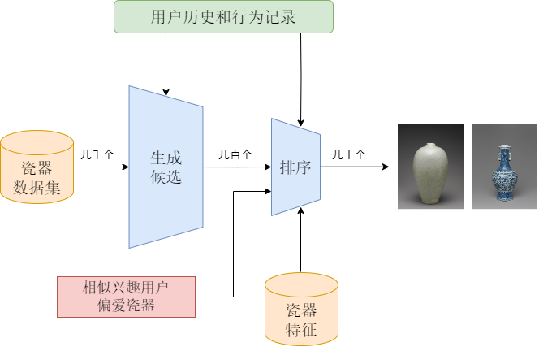
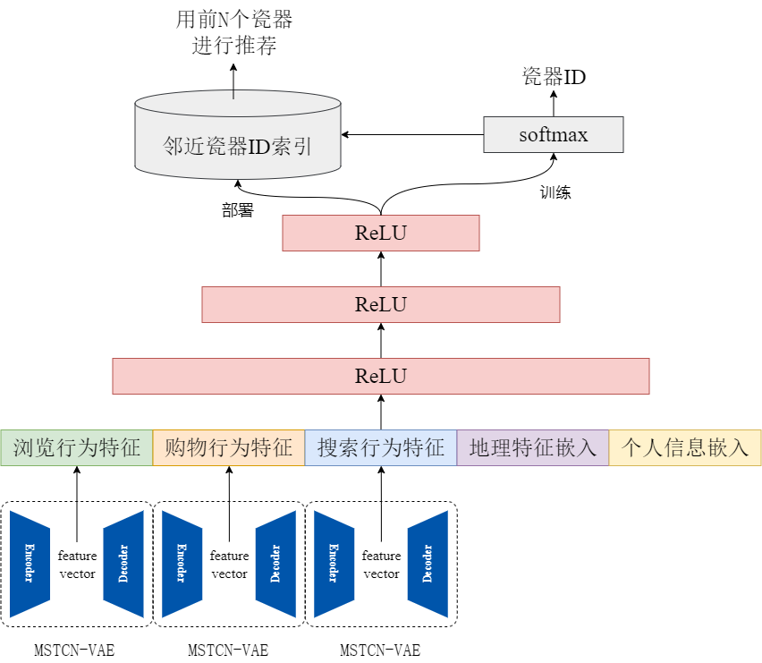

# Porcelain Garden ("赏瓷苑")


## Project Overview
This project, "赏瓷苑" (Porcelain Garden), is an online platform featuring a recommendation system for porcelains. The system integrates a CNN-based classifier for identifying the dynasty of porcelains and a recommendation algorithm tailored to user preferences. It combines state-of-the-art deep learning techniques with a user-friendly web interface to enhance the ceramic appreciation experience.

## Key Features

1. **Image Dataset Preparation and Processing**
   - Collected a large number of high-quality porcelain images from online sources.
   - Conducted manual curation to ensure clarity and quality.
   - Organized the images into an SQL database using the `pymysql` library for efficient access.
   - Preprocessed the images through:
     - Grayscale conversion.
     - Size normalization.
     - Data normalization for neural network training.

2. **Deep Learning-Based Recommendation System**
   - Utilized a CNN-based model for classifying porcelains by dynasty.
   - Incorporated a dual-network recommendation algorithm:
     - **Candidate Generation Network**: Narrowing down potential recommendations.
     - **Preference Ranking Network**: Sorting recommendations based on user interest.
   - Packaged the recommendation algorithm to suggest porcelains based on user history.

3. **Online Platform**
   - Developed an interactive online platform for showcasing the ceramic database.
   - Designed a user-friendly interface for seamless exploration and interaction.

   
   
   
4. **User Behavior Data Collection and Analysis**
   
   - Collected user browsing and search history (with user consent) to enhance recommendation accuracy.
   - Analyzed user behavior to construct user profiles and refine the recommendation model over time.
   
5. **Advanced Recommendation Algorithm**
   - Leveraged deep learning to analyze historical user data.
   - Built robust user profiles for predicting and addressing both current and future user interests.
   - Ensured personalized recommendations for optimal user satisfaction.
   
   <div style="display: flex; justify-content: center; align-items: center;">
     <div style="text-align: center; margin: 0 20px;">
       
       <p>Candidate Generation Network</p>
     </div>
     <div style="text-align: center; margin: 0 20px;">
       
       <p>Preference Ranking Network</p>
     </div>
   </div>
   
   

## Technical Stack
The project's technical stack spans from the front-end UI to the back-end database and includes the following components:

- **Frontend**: Developed for intuitive user interaction and seamless navigation.
- **Backend**: Powered by Python with integrated CNN models for classification and recommendation.
- **Database**: SQL database structured for efficient data retrieval and storage.
- **Deployment**: Hosted on a scalable online platform for real-time access.

## How to Use
1. Clone the repository:
   ```bash
   git clone https://github.com/Wenxuan52/CSIEP-Porcelain-Garden.git
   ```
   
2. Set up the environment:
   - Install dependencies using Maven for the main system.
   - Ensure Python dependencies are installed for the CNN classifier and recommendation algorithms.
   
3. Run the system:
   - Start the backend server.
   - Access the web platform via the provided URL.
   
4. Explore and interact with the platform to experience personalized ceramic recommendations.

## Web Demo


## Future Work
- Further optimize the CNN classifier for improved accuracy.
- Expand the dataset with more diverse ceramic styles and periods.
- Enhance the recommendation algorithm by integrating hybrid techniques.
- Continuously improve user data privacy and security.

---

Thank you for exploring the Porcelain Garden ("赏瓷苑") project. We hope you enjoy discovering the world of porcelains with our platform!
